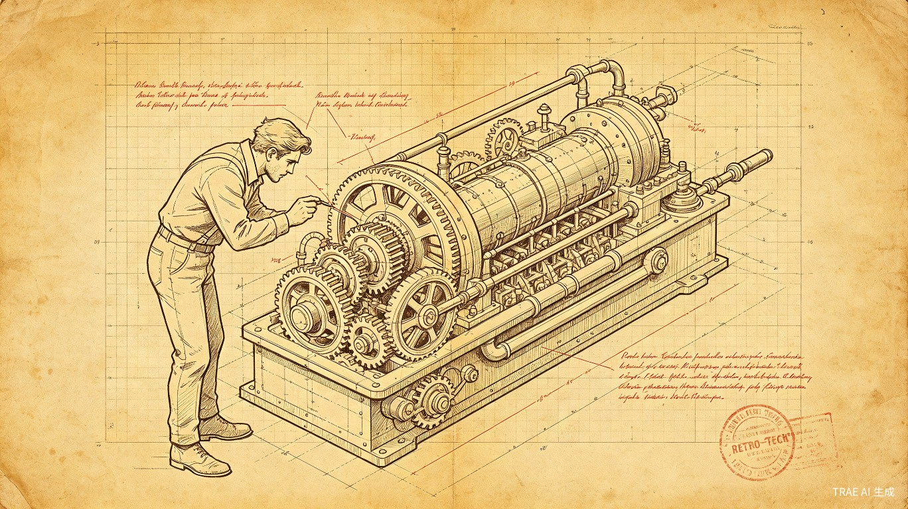
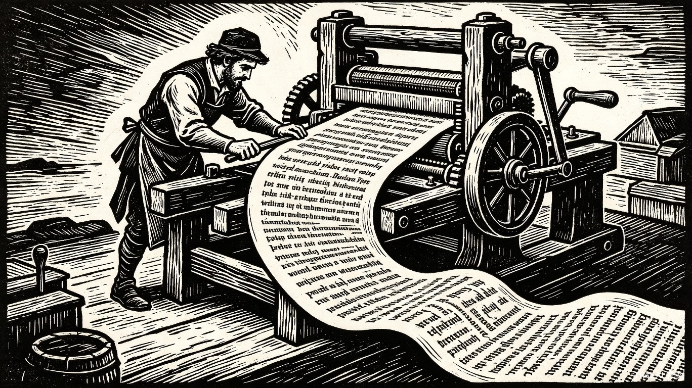

<h1 align="center">Article Image Generator</h1>

<p align="center">
  <strong>AI 驱动的文章视觉叙事工具 — 将文字内容转化为引人入胜的插图，支持多种画幅和数量自定义</strong>
</p>

<p align="center">
  <a href="#核心功能">核心功能</a> •
  <a href="#安装指南">安装指南</a> •
  <a href="#快速开始">快速开始</a> •
  <a href="#工作流">工作流</a> •
  <a href="#画风系统">画风系统</a> •
  <a href="#概念体系">概念体系</a>
</p>

<p align="center">
  <a href="README.md">English</a> •
  <a href="README.ja.md">日本語</a> •
  <a href="README.ko.md">한국어</a>
</p>

---

## 项目简介

**Article Image Generator** 是一款专为 Codex、Trae 和 Claude Code 设计的 AI Skill，能够将文字内容转化为视觉冲击力强的插图。与通用 AI 绘画工具或图库搜索不同，它能理解文章的叙事结构，生成真正作为思想视觉延伸的图像 —— 而非单纯的装饰。

围绕两种**角色锚定模式**、十种**画风**，以及可自定义的**画幅比例**（16:9、9:16、4:3、3:4、1:1、21:9）和**配图数量**（1-9 张）构建，本 Skill 能够根据内容的平台、调性、主题和受众预期调整创意输出。

> "插图不应只是图解 —— 它应该是延伸。"

---

## 核心功能

### 三种锚定模式

根据内容需求选择最适合的视觉方案：

| 维度 | 品牌锚定模式 | 情境锚定模式 | 无角色模式 |
|------|-------------|-------------|----------|
| **核心逻辑** | 上传角色参考图，所有插图使用同一形象 | 根据文章主题为每篇内容定制专属角色 | 没有任何角色 —— 纯概念通过抽象元素、物体关系或场景氛围表达 |
| **最佳场景** | 品牌内容、系列文章、个人 IP、企业博客 | 深度文章、创意实验、热点追踪 | 数据分析、方法论、概念说明、氛围营造 |
| **角色一致性** | 最高（所有内容同一形象） | 高（同一文章内同一形象） | 无角色 |
| **品牌辨识度** | 强（视觉签名） | 弱（内容优先） | 无（纯概念） |
| **创作自由度** | 受现有角色约束 | 无边界，最大化创意潜力 | 最高（无角色约束） |
| **用户操作** | 上传参考图 → 自动复用 | 确认角色概念 → 继续生成 | 选择视觉方向 → 继续生成 |

**品牌锚定模式**适合建立视觉身份的内容创作者。上传一次角色参考图，每篇文章都出现你的标志性形象。

**情境锚定模式**适合内容本身需要独特视觉声音的场景。角色只存在于这篇文章中，与内容不可分割。

**无角色模式**适合让概念本身成为视觉。没有面孔、没有形象、没有 IP —— 只有纯粹的视觉隐喻、物体关系或氛围场景，直接传达思想。同一文章的所有插图仍共享**统一的锁定视觉风格**（Step 5 选定），确保整套图即使没有固定角色也能保持视觉一致性。

---

### 可自定义画幅与数量

生成前 Skill 会引导你完成两个快速配置步骤：

**画幅选择** —— 选择匹配目标平台的画布形状：

| 比例 | 方向 | 最佳使用场景 |
|:---:|:---:|:---|
| **16:9** | 横版 | 文章正文配图、公众号、博客、视频封面（默认） |
| **9:16** | 竖版 | 小红书、抖音、手机壁纸、短视频 |
| **4:3** | 横版 | PPT、课件、报告、演示文档 |
| **3:4** | 竖版 | 小红书图文、Instagram、社交媒体 |
| **1:1** | 方形 | 头像、社交媒体、产品图、方形海报 |
| **21:9** | 超宽 | 横幅、网站封面、B站头图、宽屏展示 |

Skill 会根据内容类型智能推荐画幅，但你可以覆盖为任意比例。

**数量选择** —— 选择生成多少张配图（1-9 张）：

| 文章长度 | 推荐数量 |
|:---|:---:|
| 短文（< 1000 字） | 1-3 张 |
| 中篇（1000-3000 字） | 4-6 张 |
| 长文（> 3000 字） | 7-9 张 |

---

### 十种画风

生成前 Skill 会提示你选择画风 —— 一套完整的美学系统，改变基础视觉基因：

| 编号 | 画风 | 视觉特征 | 最佳场景 |
|:---:|:---|:---|:---|
| 0 | **基础素描** | 白色画布、黑色手绘线条、怪诞清晰 | 默认 — 科技、商业、通用 |
| 1 | **复古科技** | 泛黄工程手册、机械制图美学 | 历史、工业、怀旧 |
| 2 | **有机温暖** | 植物脉络、水彩晕染、自然生长 | 环境、健康疗愈、生活方式 |
| 3 | **极简几何** | 包豪斯网格、精确分割、克制色彩 | 数据可视化、设计、高端理性 |
| 4 | **混合媒介** | 照片底图+手绘叠加、真实物体混搭 | 教程、DIY、创意过程 |
| 5 | **水墨禅意** | 东方水墨、留白意境、笔触浓淡 | 文化、哲学、东方美学 |
| 6 | **赛博霓虹** | 霓虹光效、暗色背景、科技发光 | 未来科技、AI、元宇宙、数字文化 |
| 7 | **木刻版画** | 强烈黑白对比、刀刻纹理、民间艺术 | 社会议题、人文、力量表达 |
| 8 | **黏土定格** | 3D 黏土质感、手工捏制、圆润可爱 | 教育、儿童、轻科普、治愈 |
| 9 | **故障艺术** | 数字故障、条纹错位、数据衰减美学 | 数字批判、黑客文化、实验艺术 |

每种画风包含完整的提示词注入模板，自动生成时自动附加到指令中，确保文章内所有插图视觉统一。

**风格预览** — 同一角色、同一场景、10 种不同画风：

| 基础素描 | 复古科技 | 有机温暖 | 极简几何 | 混合媒介 |
|:---:|:---:|:---:|:---:|:---:|
|  |  |  |  |  |

| 水墨禅意 | 赛博霓虹 | 木刻版画 | 黏土定格 | 故障艺术 |
|:---:|:---:|:---:|:---:|:---:|
|  |  |  |  |  |

---

### 概念熔炉：四种创意方法论

情境锚定模式包含四种角色设计方法论，确保视觉主角绝非随机产物，而是深思熟虑的概念延伸：

**1. 直译法**
将文章核心概念直接翻译为视觉形式：
- "光芯片瓶颈" → 一个被两堵墙挤压的光线编织人形
- "数据洪流" → 一条由流式二进制代码组成的鱼

**2. 异质合成**
将三个不相关的领域强制组合为连贯视觉：
- 结构（厨房/邮局/工厂/森林）× 质感（电路板/纸张/玻璃/植物）× 动作（攀岩/烹饪/侦探/航海）
- 示例：邮局结构 + 纸张质感 + 烹饪动作 = 一个由信封和邮票构成的厨房，角色在其中"烹饪"信息

**3. 认知错位**
四种刻意的错位创造难忘视觉：
- **尺度错位**：芯片放大到城市大小，或海洋缩小到茶杯
- **功能错位**：用雨伞当漏斗，或让大象穿针
- **时空错位**：用算盘处理 AI 数据，或用激光笔写毛笔字
- **情感错位**：焦虑的芯片冒汗，或懒惰的光纤拒绝传输

**4. 随机触发**
方向不明时，从池中组合：
- 材质（金属/玻璃/纸张/木头/光）+ 实体（猫/鸟/树/齿轮/云）+ 职业（信使/守卫/厨师/侦探）+ 情绪（焦虑/冷静/兴奋/困惑）

---

### 用户确认流程（情境锚定模式）

Skill 绝不会未经你批准就生成角色：

1. **呈现方案**：基于文章主题生成 2-3 个角色概念，每个包含名称、视觉描述、性格特征和主题关联逻辑
2. **等待选择**：你选择、修改或提供自己的概念
3. **固化描述**：确认后的角色描述被锁定，用于文章所有插图
4. **统一执行**：文章中每张图使用同一角色，确保视觉一致

---

### 多语言标注支持

Skill 自动识别文章语言并生成对应语言的标注，也可手动选择：

| 识别语言 | 标注风格 | 示例 |
|:---|:---|:---|
| **中文** | 横排，2-8 字，手写体 | 光芯片 / 数据流 / 瓶颈 |
| **英文** | 横排，1-3 词，手写体 | Light Chip / Data Flow / Bottleneck |
| **日文** | 横排或竖排，简短词组 | 光チップ / データ流 / ボトルネック |
| **韩文** | 横排，简短词组 | 광칩 / 데이터 흐름 / 병목 |

**自动识别**：分析文章文字（>50% 字符类型判断）。**手动覆盖**："用英文标注"。

---

### 快速模式 vs 专家模式

根据时间和控制需求选择工作流：

| 维度 | 快速模式 | 专家模式 |
|------|---------|---------|
| **步骤** | 1 步自动检测 | 完整 10 步流程（Step 0-9） |
| **适合** | 快速出图、老用户 | 新用户、精细控制 |
| **参数** | 全部自动检测 | 用户逐项选择 |
| **策略报告** | 跳过 | 可选生成前输出 |

**快速模式示例**："给这篇文章生成配图" → 自动识别中文、16:9、6 张、基础素描。

**专家模式示例**："专业模式" → 逐步选择：模式 → 语言 → 画幅 → 数量 → 画风 →（可选策略报告）→ 内容分析 → 生成。

---

### 风格混合实验（专家模式）

将两种画风混合，创造独特视觉效果：

| 主风格（60-70%） | 辅风格（30-40%） | 效果 |
|:---|:---|:---|
| 水墨禅意 | 赛博霓虹 | "霓虹水墨" — 传统笔触配发光点缀 |
| 黏土定格 | 故障艺术 | "损坏的黏土" — 手工形态带数字故障 |
| 复古科技 | 有机温暖 | "生物机械复古" — 老旧机械长满植物 |

在画风选择时选 **[H] 混合模式** 激活。

---

### 历史记录与复用

每次生成后自动保存参数，简单命令即可复用：

| 命令 | 操作 |
|:---|:---|
| "和上次一样" | 加载上次参数 |
| "用默认设置" | 加载保存的默认 |
| "保存为默认" | 保存当前参数 |
| "查看历史" | 列出最近 10 次 |
| "复用第3次" | 加载指定会话 |

历史保存在本地 `output/session-history.json`，不上传云端。

---

### 系列文章角色延续

写系列文章？保存情境锚定角色，跨文章复用：

1. **保存**："保存这个角色用于AI周报系列" → 存入历史记录
2. **复用**："用AI周报的角色" → 跳过确认，直接使用
3. **管理**：列出、更新、退役或克隆系列角色

| 特性 | 品牌锚定 | 系列角色 | 情境锚定 |
|------|---------|---------|---------|
| 范围 | 所有内容 | 一个系列 | 一篇文章 |
| 持久性 | 永久 | 半永久 | 临时 |
| 最佳场景 | 个人IP | 专栏、Newsletter | 单篇文章 |

---

### 配图策略报告（专家模式）

生成前可请求策略报告，理解视觉设计思路：

```
"先出策略"
```

报告包含：
- **内容分析**：文章类型、核心论点、目标受众
- **视觉锚点**：哪些段落需要配图及原因
- **认知负荷图**：纯文字段落 vs 配图段落
- **角色策略**：为什么这个角色适合内容
- **风格理由**：为什么这个风格匹配调性
- **数量与位置**：配图数量及放置逻辑

将配图生成变成可教学的内容设计过程。

---

### 首次使用引导

新用户首次使用时自动进入**逐步引导模式**：

1. **欢迎**：友好介绍，可随时跳过
2. **模式解释**：品牌锚定 vs 情境锚定的视觉对比和适用场景
3. **语言选择**：每种语言选项的清晰说明
4. **画幅指南**：可视化形状预览 + 平台推荐
5. **数量指南**：字数→配图数映射 + 认知目的说明
6. **风格画廊**：每种风格配 emoji 图标、描述和最佳场景
7. **内容输入**：支持的格式说明
8. **策略报告**：可选生成前分析
9. **角色选择**：引导式角色概念对比
10. **完成总结**：参数汇总 + 下次使用技巧

跳过命令："跳过引导" / "不再显示" / "快速模式"

---

### 错误处理

常见问题提供清晰引导：

| 场景 | 恢复方案 |
|------|---------|
| 参考图未找到 | 提示上传或切换情境锚定 |
| 参考图太小/模糊 | 说明要求，提供替代方案 |
| 参考图含多个角色 | 询问使用哪个，提供裁剪建议 |
| 文章太短（<500字） | 建议1张封面图或提供更多内容 |
| 文章太长（>5000字） | 建议分段生成 |
| 角色不一致 | 加强关键词，简化设计 |
| 标注语言错误 | 重新生成并显式声明语言 |
| 风格未正确应用 | 加强风格注入重新生成 |
| 生成失败（限流） | 等待30秒重试，减少数量 |

所有错误均包含：出了什么问题、为什么、以及2-3个可操作的选项。

---

### 风格预览画廊

10 种风格的预览图存放在 `assets/style-previews/`。说"看看风格效果"即可浏览选择。

---

## 安装指南

### 前置要求

- **Codex**、**Trae** 或 **Claude Code**（任一支持 Skill 系统的 AI 助手）
- 已启用图像生成能力（GPT Image 2 / ChatGPT Images 2.0）
- Git（用于克隆）

### 方式一：Git 克隆（推荐）

```bash
git clone https://github.com/ifeihong/article-image-generator-skill.git
cd article-image-generator-skill
```

将仓库内容复制到 AI 助手的 Skills 目录：

| AI 助手 | Skills 目录 |
|---------|------------|
| **Codex** | `~/.codex/skills/` 或项目根目录的 `.codex/skills/` |
| **Trae** | `~/.trae/skills/` 或项目根目录的 `.trae/skills/` |
| **Claude Code** | `~/.claude/skills/` 或项目根目录的 `.claude/skills/` |

预期目录结构：
```
skills/
└── article-image-generator/
    ├── SKILL.md
    ├── README.md
    ├── README.zh.md
    ├── README.ja.md
    ├── README.ko.md
    ├── output/                       ← 生成的插图（自动生成）
    ├── assets/
    │   ├── style-previews/           ← 10 种风格预览图（仓库自带）
    │   └── ip-reference/             ← 品牌锚定参考图（用户自行上传）
    │       └── ip.png
    └── references/
        ├── visual-genome/
        ├── character-anchors/
        ├── concept-forge/
        ├── narrative-structures.md
        ├── generation-protocols.md
        └── quality-gates.md
```

### 方式二：直接安装（Trae/Codex 原生）

部分 AI 助手支持从 GitHub URL 直接安装：

```
Install Skill: https://github.com/ifeihong/article-image-generator-skill
```

### 方式三：手动下载

1. 从 [GitHub Releases](https://github.com/ifeihong/article-image-generator-skill/releases) 下载
2. 解压到 Skills 目录
3. 品牌锚定模式下，将角色参考图放入 `assets/ip-reference/ip.png`

---

## 快速开始

### 基础调用

```
使用 Article Image Generator 为这篇文章生成插图。
```

或提供文章内容：

```
为以下内容生成插图：
[粘贴文章正文]
```

### 指定模式

```
使用品牌锚定模式。    ← 使用 assets/ip-reference/ 下的参考图
使用情境锚定模式。    ← 生成自定义角色
```

### 指定画幅与数量

```
使用 9:16 画幅，6 张配图。           ← 直接指定画幅+数量
使用 Article Image Generator，4:3 画幅，3 张配图。  ← 画幅+数量
```

### 指定画风

```
使用赛博霓虹画风。   ← 直接指定画风
使用 Article Image Generator，水墨禅意风格。  ← 按风格名
```

### 指定语言

```
用英文标注。         ← 手动指定标注语言
使用日文标签。       ← 日文标注
```

### 快速模式 vs 专家模式

```
给这篇文章生成配图。                    ← 快速模式（自动检测所有参数）
使用专家模式。                          ← 完整 10 步流程（Step 0-9）
和上次一样。                            ← 复用上次参数
先出策略。                              ← 专家模式 + 策略报告
```

### 系列角色

```
保存这个角色用于AI周报系列。            ← 保存系列角色
用AI周报的角色。                        ← 复用系列角色
```

### 完整示例

```
使用 Article Image Generator，情境锚定模式，9:16 画幅，6 张配图，
赛博霓虹风格，为以下文章生成插图：

[文章正文...]
```

---

## 专业工作流：10 步流程（Step 0-9）

```
Step 0: 工作流模式选择 → Step 1: 模式确认 → Step 2: 语言选择
    → Step 3: 画幅选择 → Step 4: 数量确认 → Step 5: 画风选择
    → Step 6: 内容消化 → Step 7: 视觉脚本（分镜表）
    → Step 8: 逐张生成 → Step 9: 质量检查与保存
```

| 步骤 | 名称 | 说明 |
|:---:|:---|:---|
| 0 | 工作流模式选择 | 选择快速模式（1步自动）或专家模式（完整控制） |
| 1 | 模式确认 | 检查 `assets/ip-reference/` 是否有参考图，询问用户偏好 |
| 2 | 语言选择 | 自动检测或手动选择标注语言（zh/en/ja/ko） |
| 3 | 画幅选择 | 选择画布形状：16:9、9:16、4:3、3:4、1:1 或 21:9 |
| 4 | 数量确认 | 确认插图数量（1-9 张，智能推荐） |
| 5 | 画风选择 | 从 10 种视觉风格中选择；可选混合模式 |
| 6 | 内容消化 | 分析文章结构、认知锚点、视觉机会 |
| 7 | 视觉脚本（分镜表） | 规划每张图：位置、主题、构图、标注 |
| 8 | 逐张生成 | 按序生成插图，注入风格/角色/画幅 |
| 9 | 质量检查与保存 | 检查质量，迭代优化，保存到 `output/<article-slug>/` |

---

## 视觉基因

所有风格共享的基础 DNA：

- **可配置画幅** — 16:9（默认）、9:16、4:3、3:4、1:1 或 21:9
- **纯白画布**：无米色、暖灰、纸质纹理、渐变或阴影
- **黑色手绘线条**：纤细、略带抖动、非机械、非矢量
- **充足留白**：主体占画布 40-60%；至少 35% 空白
- **少量手写标注**：最多 5-8 处，每处 2-8 个字符
- **一图一核心**：单一动作、结构、状态或隐喻

### 色彩纪律

| 颜色 | 用途 |
|-------|---------|
| 黑色 | 主要线稿、角色、框架、主要文字 |
| 红色 | 关键标注、问题、情感点、重要提醒、结果 |
| 橙色 | 主要流程、路径、箭头、从 A 到 B 的移动 |
| 蓝色 | 补充说明、系统状态、次要解释、AI/自动化提示 |

蓝色每张图可选。色彩使用应克制 — 少即是多。

### 避免事项

- 商业插图、PPT 信息图、正式流程图
- 课程幻灯片、可爱卡通海报、儿童插图
- 复杂架构图、精致的扁平插图、科技 UI 美学
- 真实应用截图、复杂背景、渐变、阴影
- 过度解释每个节点
- 左上角标题"工作流 / 系统架构 / 常见陷阱"

---

## 技术说明

### 参考图上传（品牌锚定模式）

当前 Codex/Trae `GenerateImage` 工具不支持 `reference_image` 参数。品牌锚定模式通过以下方式实现一致性：

1. **增强文本描述**：在每个提示词中嵌入全面的角色外观描述
2. **GPT Image 2 会话上下文**：同一会话内的多轮生成引用历史输出
3. **固定角色描述**：所有图像中复用的标准化描述格式

**未来增强**：当底层工具支持参考图参数时，`character-anchors/brand-anchor.md` 将更新为使用 `reference_image` 和 `reference_strength` 实现真正的图像级角色锁定。

### GPT Image 2 多图一致性

GPT Image 2 (ChatGPT Images 2.0) 支持：
- 单提示词生成 8 张一致角色和风格的图像
- 多轮对话编辑：会话内引用历史输出
- 4K 分辨率和精确文本渲染

本 Skill 利用会话上下文机制，结合固定角色描述，最大化情境锚定模式下的一致性概率。

---

## 文件结构

| 文件/目录 | 用途 |
|-----------|------|
| `SKILL.md` | Skill 主入口 — 完整工作流和调用规则 |
| `README.md` | 英文文档 |
| `README.zh.md` | 中文文档（本文件） |
| `README.ja.md` | 日文文档 |
| `README.ko.md` | 韩文文档 |
| `output/` | 生成的插图和会话历史（用户输出目录） |
| `assets/style-previews/` | 10 种画风预览图（仓库自带） |
| `assets/ip-reference/` | 品牌锚定模式参考图（用户自行上传，不在仓库中） |
| `references/visual-genome/` | 基础视觉基因和 10 种画风定义 |
| `references/character-anchors/` | 品牌锚定和情境锚定模式规范 |
| `references/concept-forge/` | 异质合成矩阵和认知错位方法 |
| `references/narrative-structures.md` | 8 种叙事构图模式 |
| `references/generation-protocols.md` | 双模式和所有画风的提示词模板 |
| `references/quality-gates.md` | 生成后质量检查清单和迭代方法 |
| `references/session-history.md` | 历史记录格式与复用命令 |
| `references/illustration-strategy-report.md` | 配图策略报告结构与认知分析框架 |
| `references/series-character-continuity.md` | 系列角色保存/复用工作流 |
| `references/onboarding-guide.md` | 首次使用引导流程 |
| `references/error-handling.md` | 错误场景与恢复策略 |
| `references/platform-detection.md` | 快速模式平台关键词自动检测规则 |

---

## FAQ

**Q: 品牌锚定模式的角色和参考图不一致。**

A: 当前环境限制。改善方法：(1) 强化提示词中的角色关键词，(2) 确保参考图清晰、完整、白背景，(3) 简化角色设计。真正的参考图支持计划在后续更新中实现。

**Q: 情境锚定模式的角色可以保存供以后使用吗？**

A: 可以。将角色描述保存为图片，放入 `assets/ip-reference/ip.png` 即可转换为品牌锚定模式。

**Q: 生成的图片可以商用吗？**

A: 取决于底层图像生成模型的使用条款。GPT Image 2 的输出通常可商用；请查看 OpenAI 当前的使用政策。

**Q: 支持英文文章吗？**

A: 目前针对中文内容优化（标注规范、排版习惯）。英文文章也可使用，但标注可能不够自然。

**Q: 一张图需要多长时间？**

A: GPT Image 2 通常每张 5-15 秒；4K 分辨率可能需要 20-30 秒。

---

## 贡献

欢迎提交 Issue 和 Pull Request！

- Bug 或问题：[提交 Issue](https://github.com/ifeihong/article-image-generator-skill/issues)
- 新风格或功能：[提交 PR](https://github.com/ifeihong/article-image-generator-skill/pulls)
- 作品展示：在 Issue 中添加 `showcase` 标签

---

<p align="center">
  如果这个项目对你有帮助，请给个 ⭐ Star！
</p>

<p align="center">
  <a href="https://github.com/ifeihong/article-image-generator-skill">GitHub 仓库</a> •
  <a href="https://github.com/ifeihong/article-image-generator-skill/issues">问题反馈</a>
</p>
